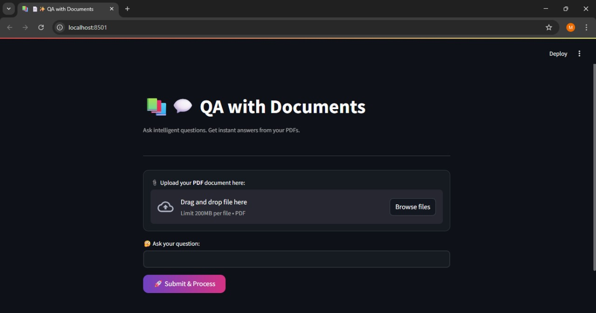

# 📚💬 QA with Documents

An intelligent question-answering system that lets you upload PDF files and ask natural language questions. Powered by **Google Gemini** embeddings and **LlamaIndex**, this app extracts insights directly from your documents — no fluff, just facts.

---

## 🚀 Features

- 🧠 Ask questions in plain English  
- 📄 Upload any PDF (up to 200MB)  
- 🔍 Get accurate answers using Gemini + LlamaIndex  
- 🖤 Beautiful dark-themed Streamlit interface  

---

## 📦 Tech Stack

- 🦙 LlamaIndex  
- 🤖 Google Gemini (embedding + LLM)  
- 🌐 Streamlit (UI)  
- 🐍 Python 3.8+  

---

## 🛠️ How to Run

1. **Clone the repo**
   ```bash
   git clone https://github.com/your-username/QA-with-Documents.git 
   cd QA-with-Documents

2. **Install dependencies**
   ```bash
   pip install -r requirements.txt

3. **Set up your .env file**
   ```ini
   GOOGLE_API_KEY=your_google_api_key

4. **Run the app**
   ```bash
   streamlit run StreamlitApp.py
   
## 📸 Screenshot



## 🧠 How It Works

1. 📄 **PDF Ingestion**  
   PDFs are loaded and split into chunks using `SimpleDirectoryReader`.

2. 🧬 **Embedding with Gemini**  
   Each chunk is embedded via `embedding-001` from Google Gemini.

3. 🗃️ **Index Creation**  
   `VectorStoreIndex` organizes embeddings into a searchable structure.

4. 💬 **Query & Response**  
   Questions are answered using `gemini-pro` LLM, retrieving the most relevant chunks.

5. 🖥️ **Interface**  
   Results are delivered in a clean, dark-themed Streamlit UI.
